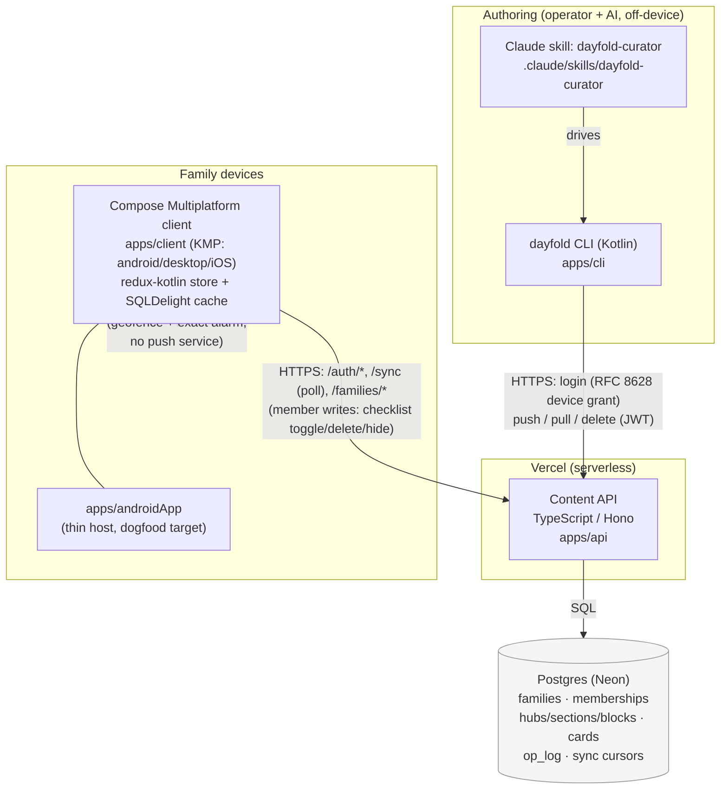

# Architecture

A map of the system as it actually runs today (2026-07-01). For product framing
see `README.md` / `adr/0004-product-framing.md`; for decisions see `adr/`; for
live build status see `backlog/now.md`. This file is descriptive (what's built),
not a design doc — update it when a component's shape changes, not on every PR.

## System overview

**Server-blind, client-rendered.** The API stores and moves typed JSON; it does
not interpret content or rank anything. All "smart" behavior (the Now feed's
priority engine, notification selection, geofencing) runs **on-device** in
`apps/client` commonMain, over data already synced. This keeps the server dumb
by design (`adr/0007-prototype-scope.md`) and location data device-local
(ADR 0044) — see Data flow below.

## Components

| Component | Path | Stack | Role |
|---|---|---|---|
| Content API | `apps/api` | TypeScript, Hono, `pg`, Zod, deployed on Vercel | Auth (mint/verify tokens, device grant, Firebase verify), family/membership CRUD, hub/card/section/block CRUD with visibility + author-gate enforcement, `/sync` cursor feed, cron sweep (tombstone GC) |
| Database | Postgres (Neon, pooled) | — | System of record: families, memberships, credentials, hubs/sections/blocks, briefing_cards, `op_log` (idempotency), `resource_visibility`, `device_authorizations`, `invites`, `refresh_tokens` |
| CLI | `apps/cli` | Kotlin, hand-rolled `java.net.http.HttpClient` (no framework) | `login` (device grant + OS keychain) / `push` / `pull` / `delete` / `template` / `whoami` / `update` — the authoring surface for operators and AI loops |
| Curator skill | `.claude/skills/dayfold-curator` | Claude Code skill (Markdown + `install.sh`) | Turns a person's context (email/calendar/notes) into Hubs + BriefingCards via the CLI, propose-confirm before every push/delete |
| Client | `apps/client` | Kotlin Multiplatform, Compose Multiplatform, redux-kotlin, SQLDelight | Shared `commonMain` holds all logic + UI: sync engine, offline cache, the Now priority/ranking engine, notification selection, hub/feed rendering. Targets: Android, desktop (dev/test), iOS (compiles; no shipped app yet) |
| Android host | `apps/androidApp` | Thin Android app depending on `:client` | The dogfood install target; owns the manifest, notification/geofence device glue (`AndroidLocalNotifier`, `AndroidGeofenceController`, `AndroidExactNotificationScheduler`) |
| Schema | `packages/schema` | `content.schema.json` → generated Zod (API) + Kotlin (`Content.kt`, shared by CLI/client) | The single content contract; CI fails if generated output is stale |
| Link rules | `packages/linkrules` | Kotlin (`commonMain`, no platform deps) | Shared phone/email linkification + URL/mailto vetting, used by both CLI (`push --no-linkify` opt-out) and client render |

## Data flow

1. **Author.** Operator or an AI loop runs the `dayfold` CLI (often via the
   curator skill) to `push` a Hub/Section/Block/BriefingCard as JSON. The CLI
   locally structure-checks it, then `PUT`s to the API with a bearer JWT.
2. **Store.** The API validates (Zod schema + visibility/audience rules +
   author-gate), stamps provenance, and upserts into Postgres. Soft-deletes
   (`deleted_at`) back both card/hub deletes and the two-way member-write
   tombstones; a cron sweep hard-purges tombstones past the retention floor
   (`CONTENT_TOMBSTONE_RETENTION_DAYS`, default 90).
3. **Sync.** Each client polls `GET /families/:fid/sync` (~45s foreground,
   resume-on-foreground) with a 3-part cursor; the API returns a page of
   deltas. A stale cursor (older than the tombstone floor) gets
   `full_resync:true` and a full rebuild.
4. **Cache + render.** The client writes deltas into its local SQLDelight DB
   (single writer, WAL), which is the *only* thing the redux store reads from
   (`network → DB → store → UI`, never network → store directly). The Now feed
   is computed on-device from cached content (`rank()` in `NowRank.kt`) —
   urgency/proximity/importance/decay, calm-budget banding, local-only
   surfacing state (`last_shown`/`dismissed`, never synced).
5. **Member writes (two-way, ADR 0038–0042).** A signed-in member can toggle a
   checklist item, delete their own block, or hide a block locally. These go
   through an **outbox** (optimistic apply → `PUT`/`DELETE` with
   `If-Match`/Idempotency-Key → drain on reconnect), not the read-only sync
   path. Author-gated (`created_by`), scoped to `content:write` /
   `content:delete`.
6. **Background notifications (ADR 0044, Phase B).** On Android, a background
   pass re-runs the *same* `rank()`/notification-selection code the foreground
   feed uses, over the on-device cache plus live (never-persisted) location, to
   decide whether to fire a **local** notification (geofence enter or exact
   alarm) — quiet-hours + daily-cap device-local config, never synced. There is
   no push service (no FCM/APNs) and no server involvement in this path.

## Auth

- **Identity:** Firebase (Google/Apple sign-in) verified server-side via JWKS,
  or a gated `/auth/dev-token` path for local dev (refuses outside
  dev/preview).
- **Tokens:** the API mints its own short-lived EdDSA access tokens + longer
  refresh tokens (`/auth/refresh`, ~20s reuse grace for race tolerance),
  independent of the identity provider.
- **CLI device login:** RFC 8628 device-authorization grant (`/device/*`) — the
  CLI prints a code, the family owner approves it in the app, the CLI polls and
  lazily mints a token. Refresh tokens live in the OS keychain (headless/CI
  fallback: a 0600 file via `--allow-env-key`).
- **Tenancy:** every content route is scoped to a `familyId`; cross-family
  access is a 404 (no existence oracle), not a 403.
- **Legacy path:** a static `HOUSEHOLD_SECRET` bearer still works on content
  routes for pre-auth-epic compatibility; new work should assume real auth.

Full design/decision record: `adr/0011` (auth architecture), `adr/0021`
(build-order), `adr/0027` (Firebase JWKS), `adr/0029`/`0030` (scope + hub
visibility), `adr/0038`–`0042` (two-way member writes), `adr/0043`/`0044` (Now
derived surfacing + background notifications).

## Deploy

- **API:** bundled with esbuild (`npm run build:fn` → `apps/api/api/index.js`)
  and deployed to Vercel (`vercel deploy --prod`). Prod DB is Neon (pooled
  connection). `npm run preflight` (`env:check` + `db:check`) gates a redeploy
  against missing env or schema drift.
- **CI** (`.github/workflows/ci.yml`): API tests against a live Postgres
  service container, client desktop tests + Compose snapshot tests, codegen +
  bundle drift guards, expect/actual parity check for KMP targets. Runs on
  every push to `main` and on pull requests.
- **CLI:** Homebrew tap distribution is spec'd (`release-cli.yml`,
  `release-cli-edge.yml`) but gated on a licensing decision (ADR 0031/0032,
  operator + counsel) before the first tagged release.
- **Android:** `release-android.yml` is the Play-track release pipeline,
  gated on secrets.

## What's out of scope today

- No push notifications service (FCM/APNs) — background notifications are
  local-only (ADR 0044).
- No E2EE (ADR 0017, deferred to M1) — content is plaintext at rest.
- No direct Gmail/Calendar OAuth server-side (restricted-scope CASA cost
  avoidance, `CLAUDE.md` guardrail 3) — email/calendar signals reach dayfold
  only via the operator/AI authoring loop, not a live integration.
- No web target shipped (KMP `wasmJs` is unblocked but the client's DB layer
  needs a sync→async migration first — see `backlog/next.md`).
